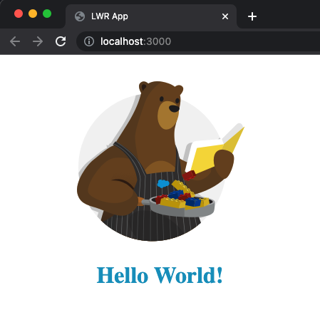
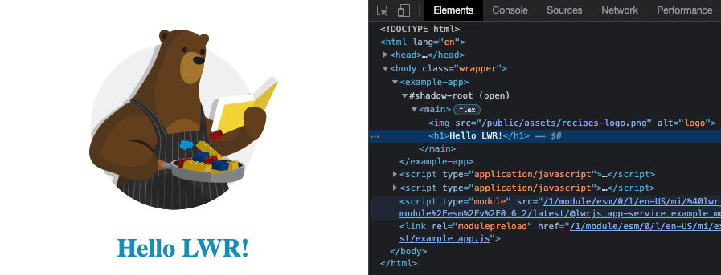

# Part 1: Create a Lightning Web Runtime (LWR) single page app

## Create the project

Use npm with the LWR scaffolding tool to create a project:

1. In a terminal, run `npm init lwr`
1. For **Project name**, accept the default, `lwr-project`.
1. For **Select a type of project**, select `Single Page App`.
1. For **Select a project template**, accept the default, `LWC`.
1. Install the project dependencies:
    ```sh
    cd lwr-project
    npm install
    ```

## Tour the project

1. Look at the project dependencies in `package.json`.
1. Look at `lwr.config.json` for routes and root component.
1. Look at the structure of the `app` root Lightning Web Component in `src/modules/example/app`.


## Run the app locally

1. Run the project in 'dev' mode:
    ```sh
    npm run dev
    ```
1. Open this URL in a browser: http://localhost:3000/

    

1. Edit `src/modules/example/app.html` and replace "World" by "LWR".
1. Notice how the web page automatically refreshes with the updated text.


## Explore Web Components

1. In your browser, right click on "Hello" and select **Inspect** from the menu
1. Notice the `example-app` Custom Element with a Shadow Root in the DOM tree. This is a Web Component.



<div align="center">
  <a href="part2.md"><b>Continue</b></a>
</div>