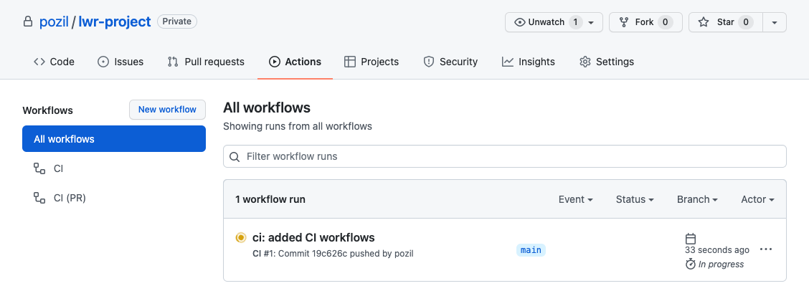
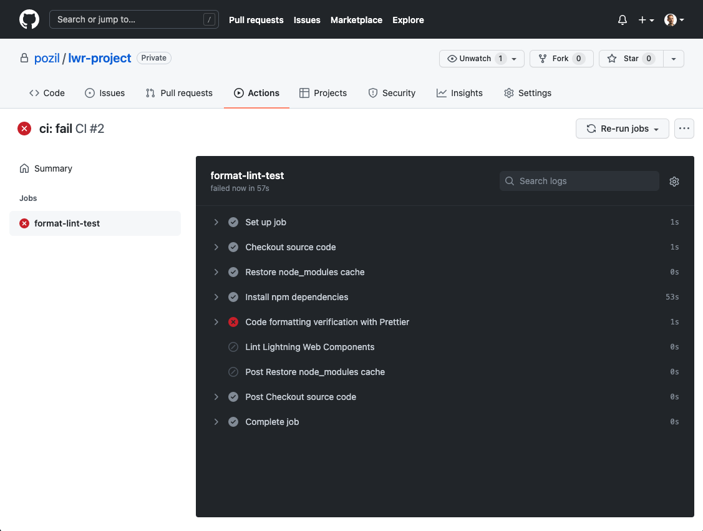

# Part 3:  Set up Continuous Integration (CI)

## Configure CI

1. Create `.github/workflows` directories in your project.
1. Copy the GitHub action worfklow files located in [this directory](base-config/ci) in the `.github/workflows` directory:
    ```
    ci.yml
    ci-pr.yml
    ```
1. Commit and push your changes:
    ```sh
    git add .github
    git commit -m "ci: added CI workflows"
    git push
    ```

## Validate CI
1. In GitHub, navigate to the **Actions** tab and select the new CI workflow run:

    

1. Select the **format-lint-test** job.
1. Wait for a couple second for the job to complete and notice that it fails:

    

1. Expand the failed step and notice the formatting error on the `.github/workflows/ci.yml`. This was intentional 😈

1. Run `npm run format` to re-format your code.

1. Commit and push your changes:
    ```sh
    git add .
    git commit -m "fix: formatting"
    git push
    ```

1. Check the new workflow run and make sure that it passes.

<div align="center">
  <a href="part4.md"><b>Continue</b></a>
</div>