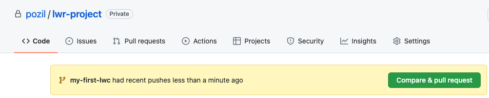
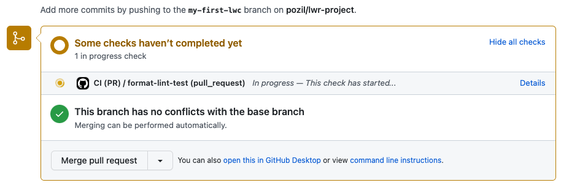

# Part 4:  Contribute to the app

## Add a new Lightning Web Component
1. Create a new git branch
    ```sh
    git checkout -b my-first-lwc
    ```
1. Create a `src/modules/example/hello` directory. We'll work in this directory unless specified otherwise.
1. Create a `hello.html` file with this content:
    ```html
    <template>
        <div>
            <h1>Hello, {greeting}!</h1>
            <label for="input-name">Name: </label>
            <input id="input-name" value={greeting} oninput={handleInput} />
        </div>
    </template>
    ```

1. Create a `hello.js` file with this content:
    ```js
    import { LightningElement } from 'lwc';

    export default class Hello extends LightningElement {
        greeting = 'World';

        handleInput(event) {
            this.greeting = event.target.value;
        }
    }
    ```


## Add your component to the app

1. Edit `src/modules/example/app/app.html` and replace
    ```html
    <h1>Hello LWR!</h1>
    ```

    by:
    ```html
    <example-hello></example-hello>
    ```

1. Start the LWR app in dev mode with `npm run dev`.
1. Open http://localhost:3000 in a browser and make sure that the app greeting updates when you change your name.


## Unit test the new component

1. Create a `src/modules/example/hello/__tests__` directory.
1. Create a `hello.test.js` file with this content in the new directory:
    ```js
    import { createElement } from 'lwc';
    import Hello from 'example/hello';

    describe('hello', () => {
        afterEach(() => {
            // The jsdom instance is shared across test cases in a single file so reset the DOM
            while (document.body.firstChild) {
                document.body.removeChild(document.body.firstChild);
            }
        });

        it('displays greeting specified by input', () => {
            const EXPECTED = 'Test';

            // Create element
            const element = createElement('example-hello', {
                is: Hello
            });
            document.body.appendChild(element);

            // Verify default greeting
            let h1 = element.shadowRoot.querySelector('h1');
            expect(h1.textContent).not.toBe(`Hello, ${EXPECTED}!`);

            // Trigger new greeting
            const inputEl = element.shadowRoot.querySelector('input');
            inputEl.value = EXPECTED;
            inputEl.dispatchEvent(new CustomEvent('input'));

            // Return a promise to wait for any asynchronous DOM updates. Jest
            // will automatically wait for the Promise chain to complete before
            // ending the test and fail the test if the promise rejects.
            return Promise.resolve().then(() => {
                // Verify displayed greeting
                expect(h1.textContent).toBe(`Hello, ${EXPECTED}!`);
            });
        });
    });
    ```

1. Run `npm test` and make sure that the test passes.

1. Commit your changes:
    ```sh
    git add src
    git commit -m "feat: my first LWC"
    ```


## Enable unit tests in the CI workflow
1. Repeat this operation for `.github/workflows/ci.yml` and `.github/workflows/ci-pr.yml`:
    - uncomment the "Unit tests" step at the end.
1. Commit your changes:
    ```sh
    git add .github
    git commit -m "ci: added unit tests to workflow"
    ```


## Create and merge a PR
1. Push your branch to GitHub:
    ```sh
    git push --set-upstream origin my-first-lwc
    ```
1. Open your GitHub project in a web browser: https://github.com/USERNAME/lwr-project
1. Compare your branch with the main branch thanks to the **Compare & pull request** button

    

1. Enter a title for your PR and click **Create pull request**.
1. Wait a couple of seconds and notice that your **CI (PR)** workflow is running in the "checks" dialog:

    

1. Wait for the CI (PR) workflow to complete and pass.

    **Hint:** if CI fails, it's likely that you need to fix formatting, commit, and push again.

1. Click **Merge pull request**

    **Note:** merging the PR triggers the **CI** workflow.

Well done, you've completed the workshop basic tasks!

<div align="center">
  <a href="bonus.md"><b>Continue to bonus tasks</b></a>
</div>